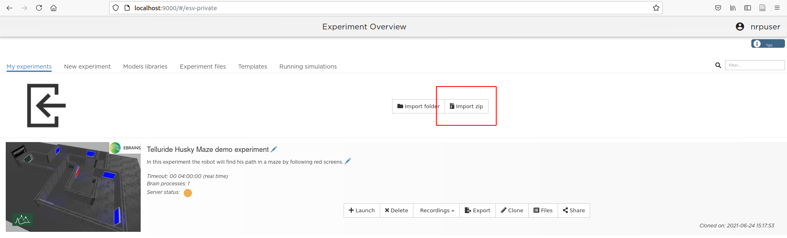

# Telluride 2021: Sensory Motor Integration Project
Neurorobotics Platform (NRP) experience code used in the SMI Project for the Telluride Neuromorphic Engineering Workshop 2021.

## Dependencies
- Neurorobotics Platform 3

## Get Started
- Be sure to have the [local NRP on Docker](https://neurorobotics.net/local_install.html) up and running.
    - ***Warning: the Windows Version on WSL2 is quite slow. Running on Linux is recommended.***
- For simplicity during development, [attach your running NRP backend container on VSCode](https://marketplace.visualstudio.com/items?itemName=ms-vscode-remote.remote-containers) with the Remote Containers extension. See [the tutorial of Antoine Detailler](https://www.youtube.com/watch?v=II2lpieBYe4&list=PLG-iqBTOyCO7pMslHsrsOm1qgvtdOwx0f&index=7) for more information.
- **Download this repository as a ZIP file** and import it in the NRP using the "Import Zip" button



## Quick guides

### Install PyTorch into a VirtualEnv and use in Transfer Functions
This quick guide is here to help you install dependencies into separated virtualenvs. Here, we will install `pytorch-cpu` (latest stable version) in a `virtualenv` and build a Transfer Function to use it.

- Open an interactive terminal inside the Docker NRP (or in the attached Visual Studio Code window).
```bash
docker exec -it nrp bash
```
- Type the following instructions:
```bash
# create the virtual env named "pytorch" 
virtualenv ~/.opt/pytorch

# activate it
source ~/.opt/pytorch/bin/activate

# install dependencies
pip install torch==1.9.0+cpu torchvision==0.10.0+cpu -f https://download.pytorch.org/whl/torch_stable.html
```
- Create a Transfer Function and copy the following code:
```python
@nrp.Robot2Neuron()
def example_pytorch(t):
    # make PyTorch available from home directory installation
    import site, os
    # WARNING: the path can change according to the python version you chose when initializing the virtualenv
    site.addsitedir(os.path.expanduser('~/.opt/pytorch/lib/python3.8/site-packages'))
    
    # output the time as a PyTorch tensor every 2s
    import torch
    tensor = torch.Tensor([t])
    if t % 2 < 0.02:
        clientLogger.info('Time: ', tensor)
```
- When you run a simulation, you will see the time printed every 2 secondes in the console logger inside the experiment.

### Install PyTorch in the platform environment (no additional virtualenv)
You can also install a pip package without having to create a virtualenv. To do so, you have to use directly the experiment's virtualenv. **Note that you may deal with conflicts in dependencies by doing so. Consequently, it is not recommended.**

- Open an interactive terminal inside the Docker NRP (or in the attached Visual Studio Code window).
```bash
docker exec -it nrp bash
```
- Type de following commands :
```bash
# activate the 'platform_venv' virtualenv
source ~/.opt/platform_venv/bin/activate

# install dependencies
pip install torch==1.9.0+cpu torchvision==0.10.0+cpu -f https://download.pytorch.org/whl/torch_stable.html
```
- Create a Transfer Function and copy the following code:
```python
import torch # we don't need to import it using site module

@nrp.Robot2Neuron()
def example_pytorch(t):
    
    tensor = torch.Tensor([t])
    if t % 2 < 0.02:
        clientLogger.info('Time: ', tensor)
```
- When you run a simulation, you will see the time printed every 2 secondes in the console logger inside the experiment.


### Install dependencies for VOneNet
Some dependencies are needed to run the project. This quick guide regroups all dependencies required to run the project. Here, we will keep the `pytorch` virtualenv created in the first quick guide. Type the following commands:

```bash
source ~/.opt/pytorch/bin/activate
pip install git+https://github.com/dicarlolab/vonenet
```

### Git management of this repository within the NRP
To facilitate the collaboration between all contributors during the project, try to commit and push changes directly inside the docker container when you're working on the NRP. If you installed the Experiment in the NRP as showed in [the "Get Started" section](#get-started), you can directly commit changes by using a docker interactive terminal.

- Open a docker interactive terminal and keep it during your work on the NRP:
```bash
# Open the docker terminal
docker exec -it nrp bash

# change directory to the experiment sources (this repository)
cd ~/.opt/nrpStorage/telluride_maze_husky_0_0_0
```
- Have fun playing with the sources!
- Now you can `git commit` or `git push` as you wish.
- **KEEP THE MAIN BRANCH CLEAN!**. Creating branches is strongly recommended.