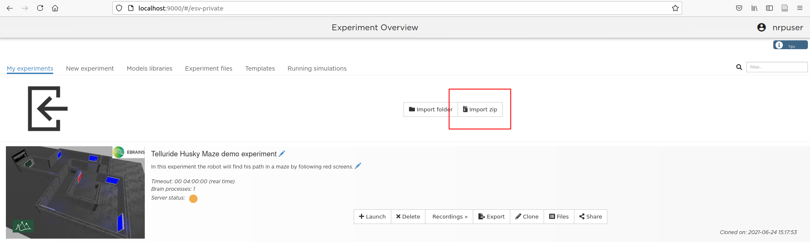

# RL Pipeline in the NRP
This documentation page is here to help you work on the Maze RL experiment using the NRP. The code environment essentially consists of :
- `iba_modules/module2.py`: an IBA module containing the whole RL pipeline
- `copy_iba_modules.py`: a quick script to copy all the IBA modules located in the `iba_modules` folder into the usual location inside the NRP container.
- `iba.launch`: the launch file to edit if you need to add another iba module in the experiment.
- `error.txt`: a text file where all errors produced by the `module2.py` IBA module will be saved (for debuggin purpose).
- `log.txt`: a text file where some logs produced by the `module2.py` IBA module will be saved (for debugging purpose).
- Basically, the other files are not interesting but I'm too afraid/tired to remove them.

This page will contain some valuable information about how to code in the IBA module, what problems you can encounter, and how to modify the main IBA module (`module2.py`).

## Some Tips

### Get Started
- Be sure to have the [local NRP on Docker](https://neurorobotics.net/local_install.html) up and running.
    - ***Warning: the Windows Version on WSL2 is quite slow. Running on Linux is recommended.***
- For simplicity during development, [attach your running NRP backend container on VSCode](https://marketplace.visualstudio.com/items?itemName=ms-vscode-remote.remote-containers) with the Remote Containers extension. See [the tutorial of Antoine Detailler](https://www.youtube.com/watch?v=II2lpieBYe4&list=PLG-iqBTOyCO7pMslHsrsOm1qgvtdOwx0f&index=7) for more information.
- **Download this repository as a ZIP file** and import it in the NRP using the "Import Zip" button



### Installation
Open an interactive terminal inside the Docker NRP (or in the attached Visual Studio Code window).
```bash
docker exec -it nrp bash

# inside container's terminal:
cd .opt/nrpStorage/telluride_maze_husky_0_0_0 # cd to experiment's folder

pip3 install torch pfrl opencv-python # and other librairies if you need
```

## RL Pipeline
Let's talk about what `module2.py` does. The features implemented in this IBA module are the agent, the environment interactions and the training process (all three at the same time):
- Initialize the agent
- Apply actions to the NRP
- Get Observations from the NRP
- Compute Rewards
- Save the agent's parameters (**every 50 episodes**)
- Reset the environment
- ...


### Configurations
All configuration parameters are introduced in the first lines of the file. I looks like this:
```python
# EPISODE CONFIGURATION
EPOCH_NUMBER = 0

# Reward configurations
R_COLLISION = -50 # reward when collision
R_ARRIVED = 100 # reward when robot arrived
C_R = 100 # judge arrival
C_D = 1.1 # DISTANCE MAX FOR THE ARRIVAL (if the robot2goal distance is less than this, the episode is over)
C_P = -0.05   # time step penalty
MAX_TIMESTEPS = 100000 # Max number of timesteps allowed before finishing the episode

# Action configuration

AGENT_WEIGHT_FILE = None # path of a weight file to load before launching the training
N_ACTIONS = 1 # Number of actions.
USE_GPU = -1 # -1 stands for "no"
IMAGE_DIMENSION = (3, 64, 64) # (C, H, W) format for the RGB images
VISUAL_ARCH = 'cornets' # architecture of the visual extractor. can be: 'cornets', 'resnet50' or 'alexnet'
LR = 1e-2 # Learning rate
```

### Modifying the Q-Function
Some changes on the RL network may be needed. So you will find a special function (`QFunction`) just below all the configuration variables. Feel free to change it if you want. It looks like this:

```python
# ARCHITECTURE OF Q_FUNCTION (for the DoubleDQN agent)
def QFunction(visual_model: nn.Module, n_actions: int):
    """
    visual_model (nn.Module): model of the visual feature extractor (must be the first module of the QFunction)
    n_actions (int): number of action (must be the output of the QFunction).
    """
    return torch.nn.Sequential(
        visual_model,
        torch.nn.Linear(1000, 500),
        torch.nn.ReLU(),
        torch.nn.Linear(500, 250),
        torch.nn.ReLU(),
        torch.nn.Linear(250, n_actions),
        pfrl.q_functions.DiscreteActionValueHead(), # Must end with this (pfrl thing) 
    )
```

### Logs, error reports, weights, etc
Inside the project repository in the container (i.e. `.opt/nrpStorage/telluride_maze_husky_0_0_0`), there are some important files you may want to read. Theses files are:
- `error.txt`: logs every error when a problem occurs. It also logs the traceback so that a quick fix can be applied. Of course, this file will be empty forever since the code is perfectly bug-free.
- `log.txt`: log file that contains some debugging information. If you edit `module2.py` and want to "print" some information to see if everything is fine, you may want to call the function `self._log_file("FOO")` inside the IBA module. If you do so, you will find "FOO" in this `log.txt` file.
- `agents/*`: directory that contains the saved weights of the designed DoubleDQN model. The module saves theses weights every 50 episodes.
- `agent_logs/*` contains log files related to the RL statistics. At the end of each episode, a log file is placed in this folder.

### Random Tips
- **Don't use the `run_step` function**. Contrary to what's stated in the IBA documentation, it simply doesn't work (for some unknown reason). The whole loop is placed inside of the camera callback function.